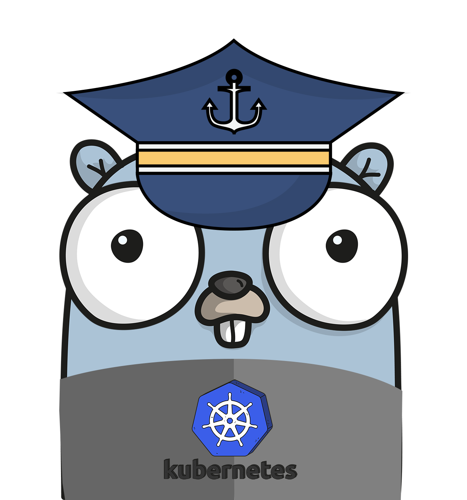

# Kubernetes on Google Cloud

## What's this

Welcome to Kubernetes on Google Cloud, the goal of this repo is to offer a collection of best practices and tutorrials for better use of GKE & Anthos products. Currently the content has been categorized for the following subjects:

- General
- Networking 
- Storage
- Day 2 Operation 
- CI/CD
- Tooling

Will include advanced topics in the future: 

- Multi/Hybrid Clusters
- Solutions on GKE
- Workaround for something 

>[Live docs](https://cc4i.github.io/multi-k8s/)

## Contributing

Encourage you to contribute to this repo if you have implemented a practice that has proven to solve something, just open an issue or a pull request to share with us, please.
