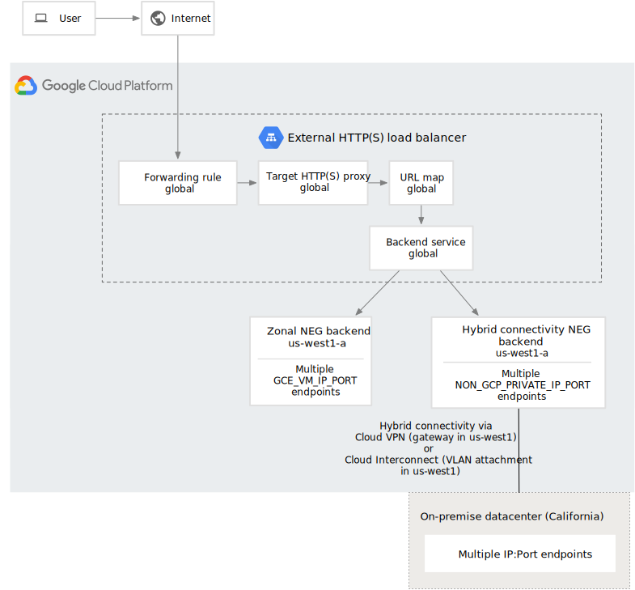

## GLB + Anthos Service Mesh (ASM) + Locality Setting

> Using GLB and ASM to implement multi-cluster traffic managment across different Cloud Providers. In each individual k8s cluster we leverage weight distrubution of Istio to reduce inter-zone traffic & cost.


### Instruction

```sh
```


### References

- Global load balance with hybrid connectivity - https://cloud.google.com/load-balancing/docs/https/setting-up-ext-global-https-hybrid


### Networking

