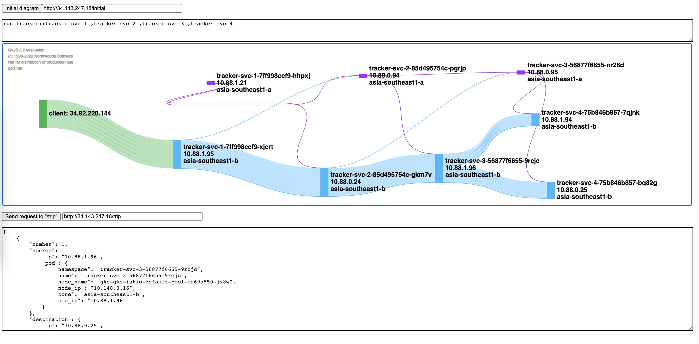

#

## Description
Visualize pods across the nodes in different zones to supports highly available and scalable, as well as leverage weight distrubution of Istio to reduce inter-zone traffic & cost.

## Deplyment

```sh
# Clone repo
git clone https://github.com/cc4i/multi-k8s.git
cd multi-k8s
cd asset/tod/bin && ./gke.sh

# Provision & deployment
skaffold build 
tag=`skaffold build --dry-run --output='{{json .}}' --quiet |jq '.builds[].tag' -r`
skaffold deploy --images ${tag}

# Apply locality setting
kubectl apply -f manifests/istio -n run-tracker

# Run
endpoint=`kubectl get svc/istio-ingressgateway -n run-tracker -o "jsonpath={.status.loadBalancer.ingress[0].ip}"`
curl -v http://${endpoint}/trip |jq

```
## Usage
The UI to understand accessing map.


```sh
endpoint=`kubectl get svc/istio-ingressgateway -n run-tracker -o "jsonpath={.status.loadBalancer.ingress[0].ip}"`

# Access by http://${endpoint}/tracker-ui
open http://${endpoint}/tracker-ui

```

## Notes