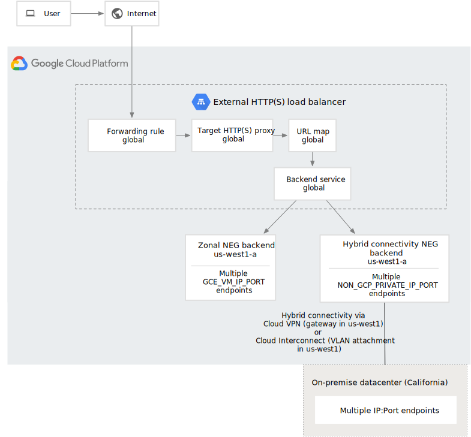

#

## Description

> Using GLB and ASM to implement multi-cluster traffic managment across different Cloud Providers. In each individual k8s cluster we leverage weight distrubution of Istio to reduce inter-zone traffic & cost.


## Deployment

```sh
# Clone repo
git clone https://github.com/cc4i/multi-k8s.git
cd multi-k8s
cd asset/tod/bin && ./gke.sh
./eks.sh


# !!!Set Kube Context for cluster in GCP & AWS, and install ASM for each of them.!!!

# GCP: 
#   gcloud container clusters get-credentials gke-istio --region asia-southeast1
#   Rename context -> cluster_name
#   Install ASM for GKE:  https://cloud.google.com/service-mesh/docs/unified-install/install-anthos-service-mesh#install_mesh_ca

# AWS:
#   aws eks update-kubeconfig --name eks-sculpture
#   Rename context -> cluster_name
#   Install ASM for EKS: https://cloud.google.com/service-mesh/docs/unified-install/install-anthos-service-mesh#install_istio_ca


#  Build application 
skaffold build 
tag=`skaffold build --dry-run --output='{{json .}}' --quiet |jq '.builds[].tag' -r`


# Switch Kube Conetxt & deploy to GKE
skaffold deploy --images ${tag}

# Switch Kube Conetxt & deploy to EKS
skaffold deploy --images ${tag}

```

## Usage
Access UI from either cluster and input initial URI, such as "gcp::192.168.0.2,aws::192.168.0.4", in order to inital Sankey.

```sh

# Access by http://${endpoint}/tracker-ui
open http://${endpoint}/tracker-ui

```


## Networking



## Notes
- Install script was built to run on Linux, so [run them in Cloud Shell or Linux](https://cloud.google.com/service-mesh/docs/unified-install/install-dependent-tools#install_required_tools) to install Anthos Services Mesh.
- Reference document : [Global load balance with hybrid connectivity](https://cloud.google.com/load-balancing/docs/https/setting-up-ext-global-https-hybrid)


