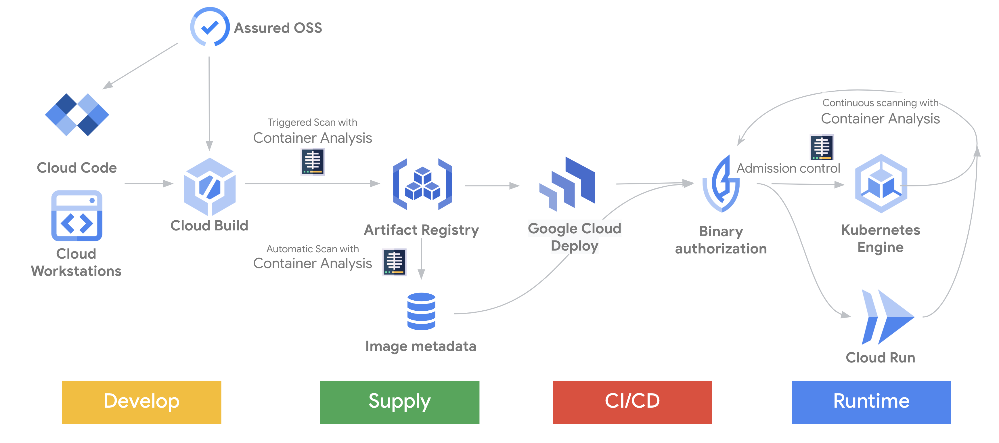

#

## Description 

Build a secure CI/CD to avoid supply chain attacks occur along the path of the software development lifecycle, where are many injection points. 

In Google Cloud there are various services and products, which provide you capability to build your own secure CI/CD, the following example is tend to demostrate how it works.

## Supply Chain Blueprint on Google Cloud

## CI/CD Demonstration

TODO

## References

- [What's new in cloud-native CI/CD](https://www.youtube.com/watch?v=8osrAosIcN4) 

- [Software Delivery Shield](https://cloud.google.com/solutions/software-supply-chain-security)