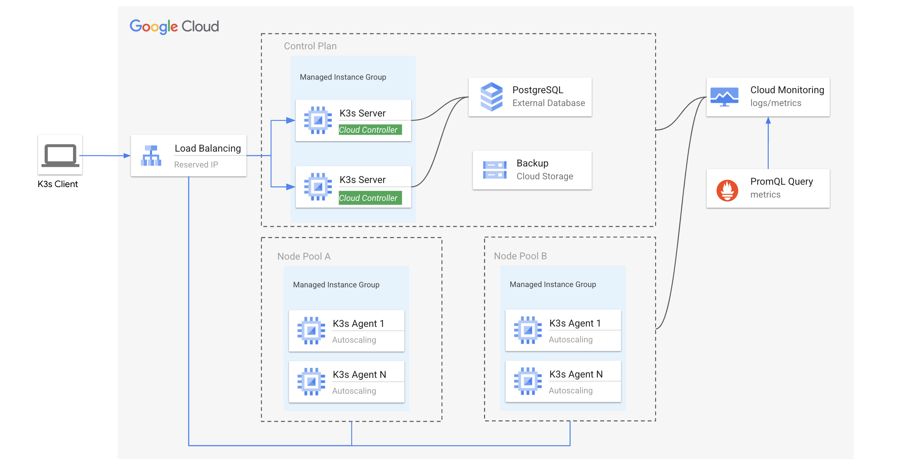

# 
## Description

K3s is a fully compliant Kubernetes distribution and packaged as a single binary. Easy to install, half the memory, all in a binary of less than 100 MB, which is great for:
- Edge
- IoT
- CI
- Development
- ARM
- Embedding K8s
- Situations where a PhD in K8s clusterology is infeasible

More detail could be found [here](https://k3s.io/). K3s can be easily deployed into GCP but you need to put some extra effort in order to achieve a production-ready cluster, try to address that as following.


## All-in-one quick-start example
The k3s cluster uses managed instance group for both server and agent nodes for high available purpose, but no auto scaling capability, no external database.

```sh
git clone https://github.com/cc4i/multi-k8s.git
cd multi-k8s/asset/k3s/bin && ./k3s-quickstart.sh
```

## High-Availability and auto-scalability K3s Cluster
To build a highly avaiable and scalable K3s cluster on GCP:

-  Leveraged the managed instance group for both server and agent (control plane and worker node pool).

- Integrated MIGs with Cloud Load Balancing with reserved IP to provide fixed registeration address. 

- Configure auto scaling policy with CPU utilization by default for MIGs, that provides underneath capability of scaling. 

- Using Cloud SQL as external database for K3s.


**Architectural diagram**


**Deployment**
```sh
cd multi-k8s/asset/k3s/bin && ./k3s-ha.sh
```


## Integrate with Cloud Controller Manager (CCM) for GCE
**Keys**

- Grant server & agent nodes with permission in order to provision network resources.

- Allow port:60000 in the firewall rules.

- Following guidance to build Cloud Controller Manager (CCM) and push into your own image registry.

- Configure RBAC and allow CCM working properly, see [reference](https://github.com/cc4i/multi-k8s/tree/main/asset/k3s/manifests).

**Steps**

- Create service account with proper permissions.

- Create instance template for K3s server.

- Create managed instance group with server template.

- Install K3s server side.

- Create agent instances template for K3s agent.

- Cerate managed instance group with agent template.

- Taint server node.

- Deploy CCM for GCE into K3s cluster.


## Clean up

```sh
cd multi-k8s/hack && ./k3s-quickstart-cleanup.sh
```